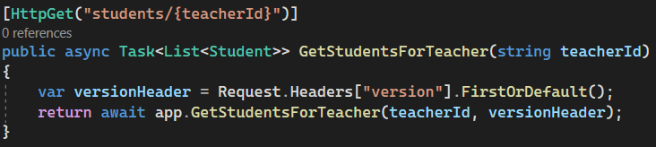
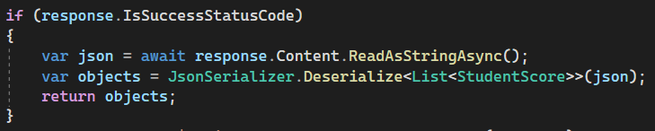
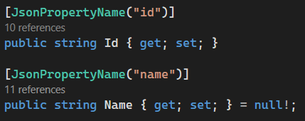

# API Versions:
We implemented different API versions utilizing different version numbers being passed via the request’s headers. We used this in 3 spots - getting a teacher’s students, getting a student’s practice score, and getting recordings. Here is an example getting a teacher’s students
## __Steps__
1. __Setup your request__
    - `var request = new HttpRequestMessage(HttpMethod.Get, $"api/PianoLessons/students/{teacherId}");`
2. __Add your header using a key-value pair__
    - `string version = "1.0";`
    - ` request.Headers.Add("version",version);`
3. __Send your request__
    - `var response = await client.SendAsync(request);`
4. __Catch and handle your request on the API__
    -  You can index the Request.Headers using the key you added earlier. If it exists thenyou will get your value.
     
5. __If you then want to send data back to your frontend service (like a list of students), you can return and deserialize it.__
    - Good practice to only do so if success
    - Read the content as a json string
    - Deserialize that json string, telling it what object to map into.
    
    - Note: The json string will default to a lowercase first letter (then normal camel case), so you may have to declare in your class object what json name it has
    