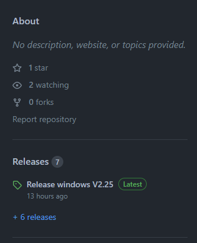
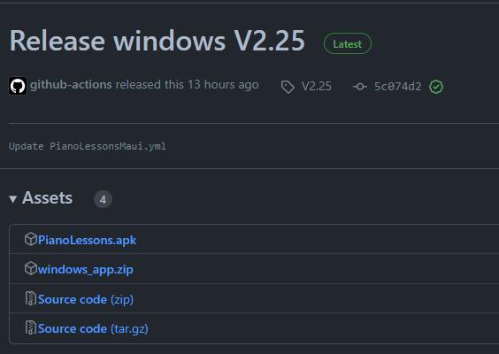

# Automated Releases:
We implemented a GitHub Actions pipeline that only runs on tagged commits and releases a build for Android APK and Windows.

*Note: If you need some help with writing the workflow file this blog could help.*
[Blog.Taranissoftware.com/building-net-maui-apps-with-github-actions](https://blog.taranissoftware.com/building-net-maui-apps-with-github-actions). The current workflow file is also saved as a file on github in this same project.

## __Steps__
1. __Add your workflow file__
     - In file view on Visual Studio if you go to file view in solution explorer you will see a .github folder. Inside this folder are the workflows that you'll make or have. From here you can add the yml file and add in the text.
     
          - 

2. __Name the workflow and have it run on tags__
     - Name specifies the name of that section that will show up on GitHub. These can be named anything as long as you know and understand what it is and does.
     - On push will always start the file and specify that what is to come next will happen whenever the project is pushed. For instance, in the following image, we are specifying whenever pushed on the master branch or a version tag is made with the same format this file will run.

          - 
     - You will also want to make sure to add the environment.

          - 
3. __Add the jobs you want to do__
     - Jobs are the tasks the file will do. For instance, the first job in this image is built and runs on Ubuntu-latest. This job has specific steps that we have given it to do. When the file runs the system will go through each item in a job and if there is any exception or error that happens on the steps the job will fail. Just because a job fails however doesn't mean that the whole workflow has failed unless everything depends on that one job.

          - 
     - If another job needs another one it will need the `needs:` header along with the name of that job. For instance, this image is referencing *line 15* in the previous image.

          - 
     3.1 __build__
     - This job builds, tests, and publishes the .NET Core application.
     ```cs
          build:
          runs-on: ubuntu-latest
          steps:
          - uses: actions/checkout@v2
          - name: Setup .NET Core
               uses: actions/setup-dotnet@v1
               with:
                 dotnet-version: ${{ env.DOTNET_CORE_VERSION }}
          - name: Restore
               run: dotnet restore "${{ env.WORKING_DIRECTORY }}"
          - name: Build
               run: dotnet build "${{ env.WORKING_DIRECTORY }}" --configuration ${{ env.   CONFIGURATION }} --no-restore
          - name: Test
               run: dotnet test "${{ env.WORKING_DIRECTORY }}" --no-build
          - name: Publish
               run: |
                 dotnet publish "${{ env.WORKING_DIRECTORY }}" --configuration ${{ env.CONFIGURATION }} --no-build --output "${{ env.AZURE_WEBAPP_PACKAGE_PATH }}"
          - name: Publish Artifacts
               uses: actions/upload-artifact@v1.0.0
               with:
                 name: webapp
                 path: ${{ env.AZURE_WEBAPP_PACKAGE_PATH }}
     ```

     3.2 __begin-release__
     - This job sets up a release for github. It specifies the output called upload_url that can be used later.It also can give the step a unique identifyer with the id and specify that its going to use the release actions. Along with any other information it should know and the Github token. 
          ```cs
               begin-release:
               runs-on: ubuntu-latest
               outputs:
                 upload_url: ${{ steps.create_release.outputs.upload_url }}
               steps:
               - name: create-release
                 uses: actions/create-release@v1
                 id: create_release
                 with:
                  draft: false
                  prerelease: false
                  release_name: Release windows ${{ github.ref }}
                  tag_name: ${{ github.ref }}
                 env:
                  GITHUB_TOKEN: ${{ github.token }} 
          ```

     3.3 __Android Job__
     - The start of the job sets up what its going to run on, permissions, jobs it needs,and the name
          ```cs
               build-android:
                 runs-on: windows-2022
                 permissions: write-all
                 needs: [build, begin-release]
                 name: Android Build
                 steps:
          ```
     - In this job we have six steps.
          - Checkout
               -    ```cs
                         - name: Checkout
                           uses: actions/checkout@v2 
                    ``` 
               - This specifies that the checkout version of the Github actions uses the second version. 
               
          - Setup .Net 7
               -    ```cs
                         - name: Setup .NET 7
                         uses: actions/setup-dotnet@v1
                         with:
                         dotnet-version: 7.0.x
                         include-prerelease: true

                         - uses: actions/setup-java@v2
                         with:
                         distribution: 'microsoft'
                         java-version: '11'
                    ```
               -    This specifies that project needs .NET and Java to run and specifies their versions.

          - Install Maui Workloads
               -    ```cs
                         - name: Install MAUI Workloads
                         run: |
                         dotnet workload install maui --ignore-failed-sources
                    ```
               - This step installs maui workload to be able to build the MAUI app.

          - Restore Dependencies
               -    ```cs
                         - name: Restore Dependencies
                         run: dotnet restore PianoLessons/PianoLessons.csproj
                    ```
               - This step will restore any dependencies the PianoLessons.csproj has.

          - Build MAUI Android
               -    ```cs
                         - name: Build MAUI Android
                         run: dotnet build PianoLessons/PianoLessons.csproj -c Release -f net7.0-android --no-restore
                    ```
               - This step will build the PianoLessons.csproj for android and will be built on release mode and no dependencies will need to be restored.

          - Upload Android Artifact
               -    ```cs
                         - name: upload android artifact-release
                         uses: actions/upload-release-asset@v1
                         env:
                            GITHUB_TOKEN: ${{ github.token }}
                         with:
                           upload_url: ${{ needs.begin-release.outputs.upload_url }}
                           asset_path: ./PianoLessons/bin/Release/net7.0-android/com.companyname.pianolessons-Signed.apk
                           asset_name: PianoLessons.apk
                           asset_content_type: application/zip
                    ```
               - This step uploads an android artifact to github release. We uses a specific actions for uploading the artifact and environment for the github. We then we upload a url that needs the begin-release job and sets it to outputs.upload_url. The asset path is the path through the files to get to the android artifact and we can then choose a name for that asset and the type of file it will be saved as.

     
     3.4 __Windows Job__
     - The start of the job sets up what its going to run on, permissions, jobs it needs,and the name. It will look just like the android one but switch everything for windows.
          ```cs
               build-windows:
                 runs-on: windows-2022
                 permissions: write-all
                 needs: [build, begin-release]
                 name: Windows Build
                 steps:
          ```
     - In this job we have eight steps.
          - Checkout & Setup .Net 7
               - The Checkout and Setup will be the same as android.

          - Setup MSBuild
               -    ```cs
                         - name: Setup MSBuild
                           uses: microsoft/setup-msbuild@v1.1
                           with:
                             vs-prerelease: true
                    ```
               - This step specifies that the microsfot setup should be used along with its specific version and allows the prerealeses of visual studio to be used too.
          - Install MAUI Workloads
               -    ```cs
                         - name: Install MAUI Workloads
                           run: |
                             dotnet workload install maui --ignore-failed-sources
                    ```
               - This is just like the android workloads though it only installs the MAUI not the android.
          - Restore Dependencies
               -    This is also the same as the android dependencies.
          - Build MAUI Windows
               -    ```cs
                           - name: Build MAUI Windows
                             run: msbuild PianoLessons/PianoLessons.csproj -r -p:Configuration=Release -p:RestorePackages=false -p:TargetFramework=net7.0-windows10.0.19041.0 /p:GenerateAppxPackageOnBuild=true
                    ```
               - This uses the msbuild we've setup for the PianoLessons.csproj using the net7.0 framework.
          - zip_file
               -    ``` cs
                         - name: zip_file
                           run: |
                               Compress-Archive -Path ./PianoLessons/bin/x64/release/net7.0-windows10.0.19041.0/win10-x64 -DestinationPath ./windows.zip
                    ```
               - This step creates a zip archive of the given directory and names it windows.zip
          - Upload Windows Artifact
               -    ```cs
                         - name: upload windows artifact-release
                           uses: actions/upload-release-asset@v1
                           env:
                             GITHUB_TOKEN: ${{ github.token }}
                           with:
                             name: windows-ci-build
                             path: PianoLessons/bin/Release/net7.0-windows10.0.19041.0/win10-x64/*

                    ```
               - Like the android this will upload the artifact that was created as a release.


4. __Check file paths and net versions__
     - a problem that can occur if you're not careful is if your dotnet versions aren't the same as the one for the project.

5. __Push origin/Pull__
     - To push your file so your workflow will run you can simply push it to GitHub and this can be in the terminal. If you are using tabs I would suggest using the following terminal commands.
          -    ```c#
               //This will simply push to a specific branch
               git add .
               git commit -m "message"
               git push origin master // you can replace master with the branch you want to push to.

               //This shows how you would push with specific tags
               git tag V1.0
               git push --tags
               ```

6. __Check GitHub__
     - To check if your workflow is running go to the project's repository in GitHub.
     - Then click on the actions tab

          - 
     - On the left side of the window you should see an Actions section. This will show all individual workflows you have or all of them and can simply click on the one you want to see.
     
          - 
     - From there you will see all the commits that had been pushed to GitHub and that ran the workflow file. When you click on a given commit you can see how the different jobs went when pushing the project.
     - If you scroll down to the bottom of the page you should see an artifacts section that has those versions of the apps/jobs.
     
          - 

     - __*Note:*__ This is if you didn't set it up with a release or have it saving the artifacts.
          - if You included the artifacts should be saved as a release than you can just go to the __Code__ tab and on the right side there is a release section. This is where you will see all your releases everytime you push that file.
               - 
          - Inside that release will be the android and windows files at the top with the names we gave them and you can open them and run them just like you would have if you only had them as artifacts.
               - 
7. __Possible problems__
     - Make the app not dependent on the shared project and instead make a shared folder with a data folder inside and link existing files to the shared files.
     - If you get a .net 7 error for the project check in the maui.csproj and make sure you have .net7.0 for the target framework and 
     -    ```
          <OutputType Condition="'$(TargetFramework)' != 'net7.0'">Exe</OutputType>
          ```
     - Also make sure to go to settings on __github > actions > and check read and write permissions__. If you don't see the settings this is likley because you do not own the repository and will have to get the owner to fix the settings.

8. __Run file__
     - open the emulator, go to the GitHub page, download apk, and trust resources to run that version. This will install that version of the app onto your device.
     - you can do the same for windows but can just do it on your computer and go into the file made and find one with the icon of the product.(likely twards the middle of the files.)

