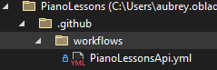
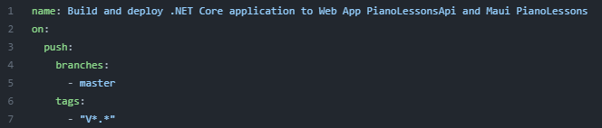
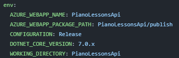
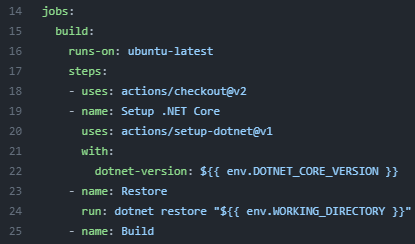
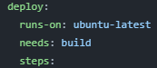
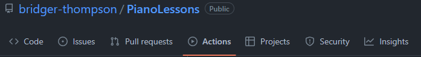
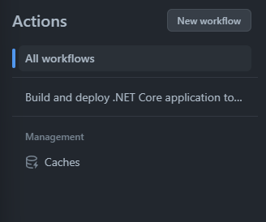
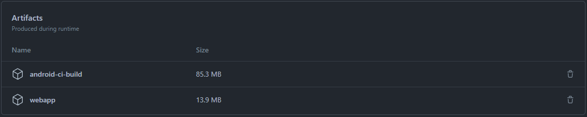

# Automated Releases:
We implemented a GitHub Actions pipeline that only runs on tagged commits and releases a build for Android APK and Windows.

*Note: If you need some help with writing the workflow file this blog could help.*
[Blog.Taranissoftware.com/building-net-maui-apps-with-github-actions](https://blog.taranissoftware.com/building-net-maui-apps-with-github-actions)

## __Steps__
1. __Add your workflow file__
     - In file view on Visual Studio if you go to file view in solution explorer you will see a .github folder. Inside this folder are the workflows that you'll make or have. From here you can add the yml file and add in the text.
     
     

2. __Name the workflow and have it run on tags__
     - Name specifies the name of that section that will show up on GitHub. These can be named anything as long as you know and understand what it is and does.
     - On push will always start the file and specify that what is to come next will happen whenever the project is pushed. For instance, in the following image, we are specifying whenever pushed on the master branch or a version tag is made with the same format this file will run.

     
     - You will also want to make sure to add the environment.

     
3. __Add the jobs you want to do__
     - Jobs are the tasks the file will do. For instance, the first job in this image is built and runs on Ubuntu-latest. This job has specific steps that we have given it to do. When the file runs the system will go through each item in a job and if there is any exception or error that happens on the steps the job will fail. Just because a job fails however doesn't mean that the whole workflow has failed unless everything depends on that one job.

     
     - If another job needs another one it will need the `needs:` header along with the name of that job. For instance, this image is referencing *line 15* in the previous image.

     
     - 

4. __Check file paths and net versions__
     - a problem that can occur if you're not careful is if your dotnet versions aren't the same as the one for the project.

5. __Push origin/Pull__
     - To push your file so your workflow will run you can simply push it to GitHub and this can be in the terminal. If you are using tabs I would suggest using the following terminal commands.
          ```c#
          //This will simply push to a specific branch
          git add .
          git commit -m "message"
          git push origin master // you can replace master with the branch you want to push to.

          //This shows how you would push with specific tags
          git tag V1.0
          git push --tags
          ```

6. __Check GitHub__
     - To check if your workflow is running go to the project's repository in GitHub.
     - Then click on the actions tab

     
     - On the left side of the window you should see an Actions section. This will show all individual workflows you have or all of them and can simply click on the one you want to see.
     
     
     - From there you will see all the commits that had been pushed to GitHub and that ran the workflow file. When you click on a given commit you can see how the different jobs went when pushing the project.
     - If you scroll down to the bottom of the page you should see an artifacts section that has those versions of the apps/jobs.
     
     
     
7. __Possible problems__
     - Make the app not dependent on the shared project and instead make a shared folder with a data folder inside and link existing files to the shared files.
     - If you get a .net 7 error for the project check in the maui.csproj and make sure you have .net7.0 for the target framework and 
     ```
     <OutputType Condition="'$(TargetFramework)' != 'net7.0'">Exe</OutputType>
     ```
     -.net workloads install maui, windows.

8. __Run file__
     - open the emulator, go to the GitHub page, download apk, and trust resources to run that version.

