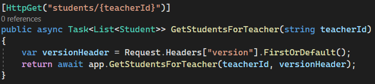

# Automated Releases:
We implemented different API versions utilizing different version numbers being passed via the request’s headers. We used this in 3 spots - getting a teacher’s students, getting a student’s practice score, and getting recordings. Here is an example getting a teacher’s students
## __Steps__
1. __Setup your request__
     
     push origin with tag.
     pull
